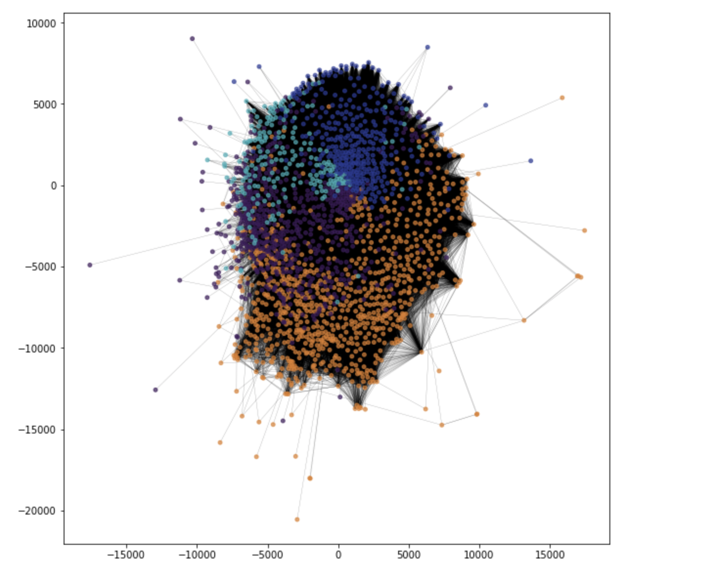

### 1. Introduction of the Project
Our project will be focusing on the movie industry. Based on the dataset obtained from MovieLens, we aim to investigate the preference of the audience and the characteristics of commonly rated good movies and bad movies.

The introduction video is here for you to get a rough idea of our project:

### 2. Data Preparation 
We will be using the available data sets due September 26, 2018 from the GroupLens website. It contains 27753444 ratings and 1108997 tag applications across 58098 movies. These data were created by 283228 users between January 09, 1995 and September 26, 2018. The total size of the datasets is 265MB. It consists of 6 csv files: ratings.csv, tags.csv, movies.csv, links.csv, genome-scores.csv and genome-tags.csv.

<style>
.tablelines table, .tablelines td, .tablelines th {
        border: 1px solid black;
        }
</style>

Name of csv file | Size (KB) | Number of Rows | Content
---------------- | --------- | -------------- | -------
Movies | 968 | 58098 | movieId: ID of a movie <br> Title: title of a movie from themoviedb.org <br> genres: genres which the movie belongs to
Ratings | 741407 | 27753444 | userId: ID of the user <br> movieId: ID of the movie referenced from Movies dataset <br> rating: A number given by a user on a 5-star scale, with half-star increments <br> timestamp: Seconds since midnight Coordinated Universal Time (UTC) of January 1, 1970.
Tags | 38814 | 1108997 | userId: ID of the user <br>  movieId: ID of the movie <br> tag: A single word or short phrase description about the movie given by the user. <br> timestamp: Seconds since midnight Coordinated Universal Time (UTC) of January 1, 1970.
Links | 1238 | 58098 | movieId: identifier for movies used by https://movielens.org. <br> imdbId: identifier for movies used by http://www.imdb.com <br> tmdbId: identifier for movies used by https://www.themoviedb.org
Genome-Scores | 405129 | 14862528 | movieId: identifier of the movie <br> tagId: identifier of the tag, referenced from Genome-Tags dataset <br> relevance: Scores of the movie in a particular genre (how strong it exerts this kind of content in the movie)
Genome-Tags | 18 | 1128 | tagId: identifier of the tag <br> tag: name of each tag

{: .tablelines}

### 3. Overview of Network
The movie review network is constructed based on the following rules:
```
Nodes - people who write the review for the movie 
Edges - people who watch/rate the same movies
Node Size - number of movies/ratings the person give
Edge weights - number of movies that both node users watched in common
```
The network is created as shown below


#### 3.1 Basic Characteristics for the Network
Here are some basic characteristics about the network:

<style>
.tablelines table, .tablelines td, .tablelines th {
        border: 1px solid black;
        }
</style>
--------------- | ----
Number of nodes | 2003
Number of edges | 232910
Average degree | 232.5612
Average shortest path distance | 1.9574773703580493
Number of connected components | 53

{: .tablelines}

<br>
Degree Distribution plots:


#### 3.2 Centrality Measures


- **Degree Centrality**
```
Degree centrality is the most basic method of defining centrality, basing the centrality 
only on the number of neighbours a node has.
```

> Degree Centrality Top 3 Values
> 0.9125874125874126 
> 0.7987012987012987 
> 0.7562437562437563

<style>
.tablelines table, .tablelines td, .tablelines th {
        border: 1px solid black;
        }
</style>
 Centrality Measure | 1 | 2 | 3
------------------- | - | - | -
Degree Centrality | 0.9125874125874126 | 0.7987012987012987 | 0.7562437562437563
{: .tablelines}

The top degree centrality is rather high this suggests they are highly connected to other nodes in the network. Thus, these nodes are most likely to be clustered in the center of the network.

- **Betweenness Centrality**
```
Betweenness centrality quantifies the number of times a node acts as a bridge along the 
shortest path between two other nodes.
```

<style>
.tablelines table, .tablelines td, .tablelines th {
        border: 1px solid black;
        }
</style>
 Centrality Measure | 1 | 2 | 3
------------------- | - | - | -
Betweenness Centrality | 0.08480222837203849 | 0.038790113817311976 | 0.027062225532841173
{: .tablelines}

The max value is 0.085 which is close to zero. Small betweenness centrality means users are generally connected directly to each other as there are very few times that the node is acting as a bridge.

- **Eigenvector centrality**
```
The eigenvector centrality thesis read: A node is important if it is linked to by other 
important nodes. It is a measure of the influence of a node in a network.
```

<style>
.tablelines table, .tablelines td, .tablelines th {
        border: 1px solid black;
        }
</style>
 Centrality Measure | 1 | 2 | 3
------------------- | - | - | -
Eigenvector Centrality | 0.06192699109472035 | 0.06107418624610914 | 0.06015765571794681
{: .tablelines}

The top eigenvector centrality scores are close to zero which implies that users do not have much influence on one another even though they are top ranked based on eigenvector centrality.

#### 3.3 Community Detection:


Download dataset by putting the link in Github

http://nbviewer.jupyter.org/github/yy96/WhatsYourKindofMovie/blob/master/PythonNotebook/Sentiment%20Analysis%20on%20Tags.ipynb
