## 1. Introduction of the Project
Our project will be focusing on the movie industry. Based on the dataset obtained from MovieLens, we aim **to investigate the preference of the audience and the characteristics of commonly rated good movies and bad movies.** 

Here to find out more though a short video. (**Check out here!**)
[](https://www.youtube.com/watch?v=XTxMXeBN4kg&t=)
***
## 2. Data Preparation 
- **Raw Datasets**
<br>
We will be using the available data sets due September 26, 2018 from the GroupLens website. It contains *27753444* ratings and *1108997* tag applications across *58098* movies. These data were created by *283228* users between January 09, 1995 and September 26, 2018. The total size of the datasets is *265MB*. It consists of 6 csv files: ratings.csv, tags.csv, movies.csv, links.csv, genome-scores.csv and genome-tags.csv.

<style>
.tablelines table, .tablelines td, .tablelines th {
        border: 1px solid black;
        }
</style>

Name of csv file | Size (KB) | Number of Rows | Content
---------------- | --------- | -------------- | -------
Movies | 968 | 58098 | movieId: ID of a movie <br> Title: title of a movie from themoviedb.org <br> genres: genres which the movie belongs to
Ratings | 741407 | 27753444 | userId: ID of the user <br> movieId: ID of the movie referenced from Movies dataset <br> rating: A number given by a user on a 5-star scale, with half-star increments <br> timestamp: Seconds since midnight Coordinated Universal Time (UTC) of January 1, 1970.
Tags | 38814 | 1108997 | userId: ID of the user <br>  movieId: ID of the movie <br> tag: A single word or short phrase description about the movie given by the user. <br> timestamp: Seconds since midnight Coordinated Universal Time (UTC) of January 1, 1970.
Links | 1238 | 58098 | movieId: identifier for movies used by [Movie Lens](https://movielens.org) <br> imdbId: identifier for movies used by [imdb](http://www.imdb.com) <br> tmdbId: identifier for movies used by [tmdb](https://www.themoviedb.org)
Genome-Scores | 405129 | 14862528 | movieId: identifier of the movie <br> tagId: identifier of the tag, referenced from Genome-Tags dataset <br> relevance: Scores of the movie in a particular genre (how strong it exerts this kind of content in the movie)
Genome-Tags | 18 | 1128 | tagId: identifier of the tag <br> tag: name of each tag

{: .tablelines}
<br>
- **Cleaned Datasets**
<br>
The data retrieved from the websites are in separate files. For the easy manipulation of data for network analysis and text analysis. We have merged and joined the datasets based on their common keys and only kept the relevant information that is needed for the analysis. After the clean-up, there are 2 master table for the further analysis

Name of csv file | Source Table | Content
---------------- | ------------ | -------
Movie Master | Links <br> Movies | **movieId: primary key** <br> Title <br> genres <br> imdbId <br> tmdbId
Review Master | Ratings <br> Tags | **userId_movieId: primary key** <br> userId <br> movieId <br> rating_combined: ratings for the user and the particular movie. If thereare multiple entries for the uerId_movieId, an average value is calculated and stored <br> timestamp_combined_ratings: If there are multiple entries for the userId_movieId, the earliest one is stored <br> tag_combined: stores all the tags for the user for this particular movie <br> timestamp_combined_tags: If there are multiple entries for the userId_movieId, the earliest one is stored
***
## 3. Network Analysis
### 3.1 Network Building
The movie review network is constructed based on the following rules:
```
Nodes - people who write the review for the movie 
Edges - people who watch/rate the same movies
Node Size - number of movies/ratings the person give
Edge weights - number of movies that both node users watched in common
```
The network is created as shown below

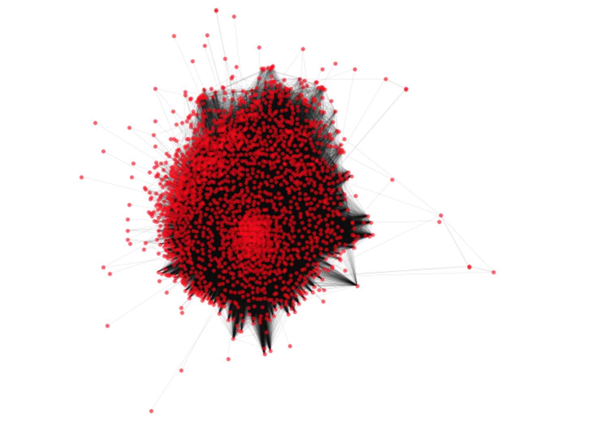

### 3.2 Network Attributes

#### 3.2.1 Sombe Basic Stats for the Network

<style>
.tablelines table, .tablelines td, .tablelines th {
        border: 1px solid black;
        }
</style>
--------------- | ----
Number of nodes | 2003
Number of edges | 232910
Average degree | 232.5612
Average shortest path distance | 1.9574773703580493
Number of connected components | 53

{: .tablelines}

<br>
Degree Distribution plots:
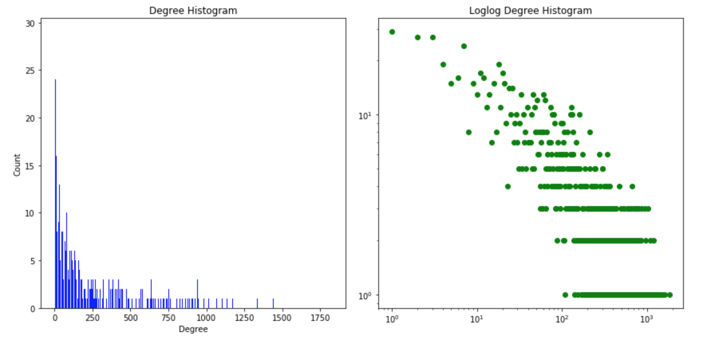
As seen from the loglog plot, the general shape of the degree distribution of the movie review network follows a power law where a large number of nodes have small connections and small number of nodes have large connctions.

#### 3.2.2 Centrality Measures

- **Degree Centrality**
> Degree centrality is the most basic method of defining centrality, basing the centrality 
> only on the number of neighbours a node has.

The top 3 values for degree centrality are as shown below. The top degree centrality is rather high this suggests they are highly connected to other nodes in the network. Thus, these nodes are most likely to be clustered in the center of the network.
<style>
.tablelines table, .tablelines td, .tablelines th {
        border: 1px solid black;
        }
</style>
1 | 2 | 3
------------------ | ------------------ | ----------------- 
0.9125874125874126 | 0.7987012987012987 | 0.7562437562437563
{: .tablelines}
<br>
- **Betweenness Centrality**
> Betweenness centrality quantifies the number of times a node acts as a bridge along the 
> shortest path between two other nodes.

The top 3 values for betweeness centrality are as shown below. The max value is 0.085 which is close to zero. Small betweenness centrality means users are generally connected directly to each other as there are very few times that the node is acting as a bridge.
<style>
.tablelines table, .tablelines td, .tablelines th {
        border: 1px solid black;
        }
</style>
1 | 2 | 3
------------------- | -------------------- | -------------------- 
0.08480222837203849 | 0.038790113817311976 | 0.027062225532841173 
{: .tablelines}
<br>
- **Eigenvector centrality**
> The eigenvector centrality thesis read: A node is important if it is linked to by other 
> important nodes. It is a measure of the influence of a node in a network.

The top 3 values for eigenvector centrality are as shown below. The top eigenvector centrality scores are close to zero which implies that users do not have much influence on one another even though they are top ranked based on eigenvector centrality.
<style>
.tablelines table, .tablelines td, .tablelines th {
        border: 1px solid black;
        }
</style>
1 | 2 | 3
------------------- | -------------------- | --------------------  
0.06193 | 0.06107 | 0.06016 
{: .tablelines}

### 3.3 Potential Correlation in Ratings Network 
In this section we are aiming to the potential correlation by assigning relevant information as the attributes for the nodes. We are interested to find out the relationship between the active-ness of an user and the average ratings/sentiment scores he/she gives.The defintion for the terms used are as follow:

```
Active-ness - It is defined by the number of distinct movies a particular user reviewed.
Average Ratings - It is the average ratings results for all the ratings the user has given.
Average Sentiment Scores - Sentiment scores are calculated based on the tags given by the user. 
This is the average results for the sentiment scores derived from all the tags the user has given.
```

We will approach the problem by building *Rating Netwok* and *Sentiment Score Network*. Besides the rules for the general network, the additional features for these new networks will be:
```
Node Size - Number of distinct movies the user watched
Node Colour - The average ratings/sentiment scores the user give based onthe colour gradient
```

#### 3.3.1 Ratings Network
We have constructed the network based on the rules mentioned above. The network is as shown below. As mentioned before, the node size represents the number of movie a user has watched. The color gradient represent the average rating score which each user gives. The higher the rating score, the darker the color. 
As the network is pretty dense, it is hard to deduct the relationship between the number of movies an user has watched and the avaerage ratings the user gives. Thus, we will investigate the relationship further by using a scatter plot.

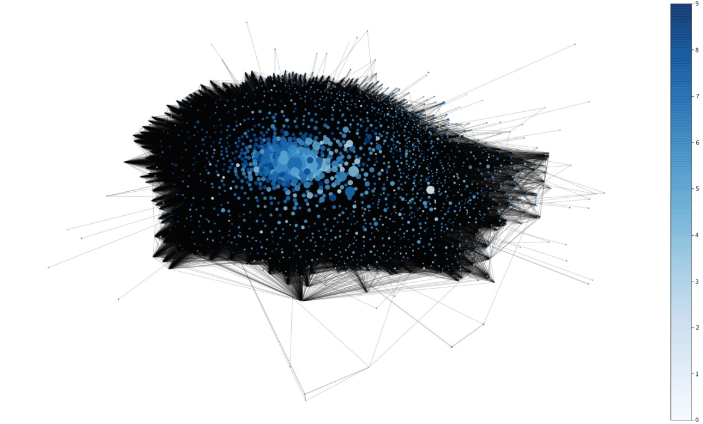

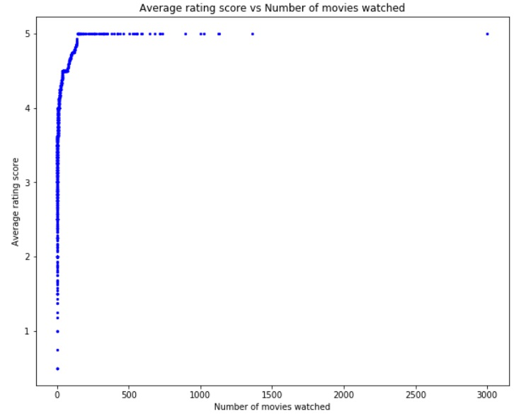

The scatter plot can be roughly divided into 3 sections, the vertical line at the front, slanted line with steep graident in the middle and horizontal line at the end. Both vertical line and horizontal line suggest there is no correlation between the acive-ness of an user and the average ratings he/she gives, while the steep gradient for the slanted line indicates weak correlation. However, the percentage of points fall in the middle section (slanted line with steep gradient) is rather small compared to other 2 sections. Thus, we would conclude there is very weak correlation between the active-ness of an user and the average ratings he/she gives.

#### 3.3.2 Reviews Network
<figure>
  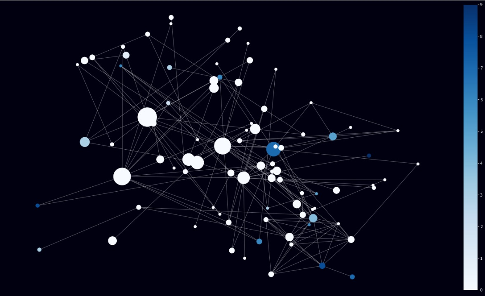
  <figcaption text-align="center">Reviews Network</figcaption>
</figure>

Similar to the ratings network (Section 3.3), users who have watched a greater number of movies has a larger sized node and users who have a higher average sentimental score are darker in color. 
From the network, we see that there are majority of users having low average sentimental scores representing by the light colour nodes. They also tend to have watched a higher number of movies compared to those with high sentimental scores. This could be due to such users having a higher expectation of movies since they have watched good movies which have left a benchmark on how a good movie should be like.

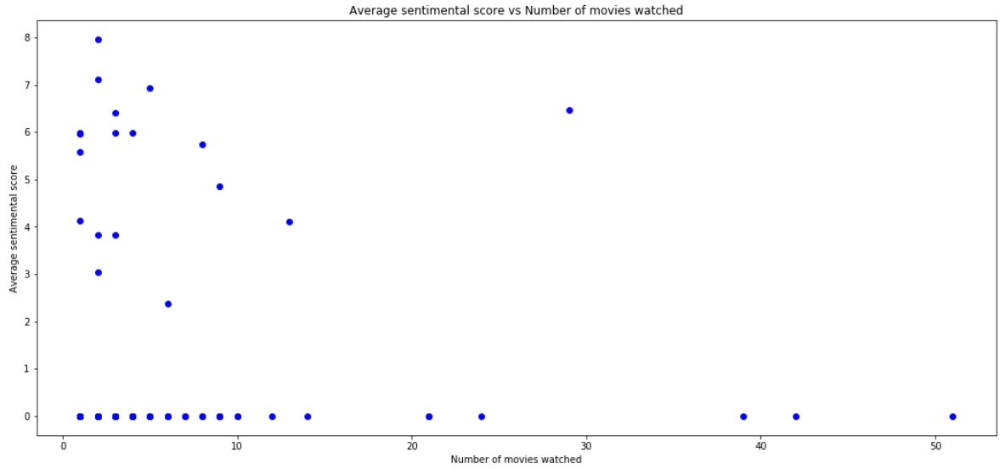

Based on the scatter plot, there seems to be a weak negative correlation between the number of movies an user watch and the average sentiment score the user gives. However, we need to note the results might not be accurate due to the limited sample size. This is due to there are a significant number of NAs which have to be excluded from the analysis, thus, limiting the sample size for the investigation.
***
## 4. Community Detection
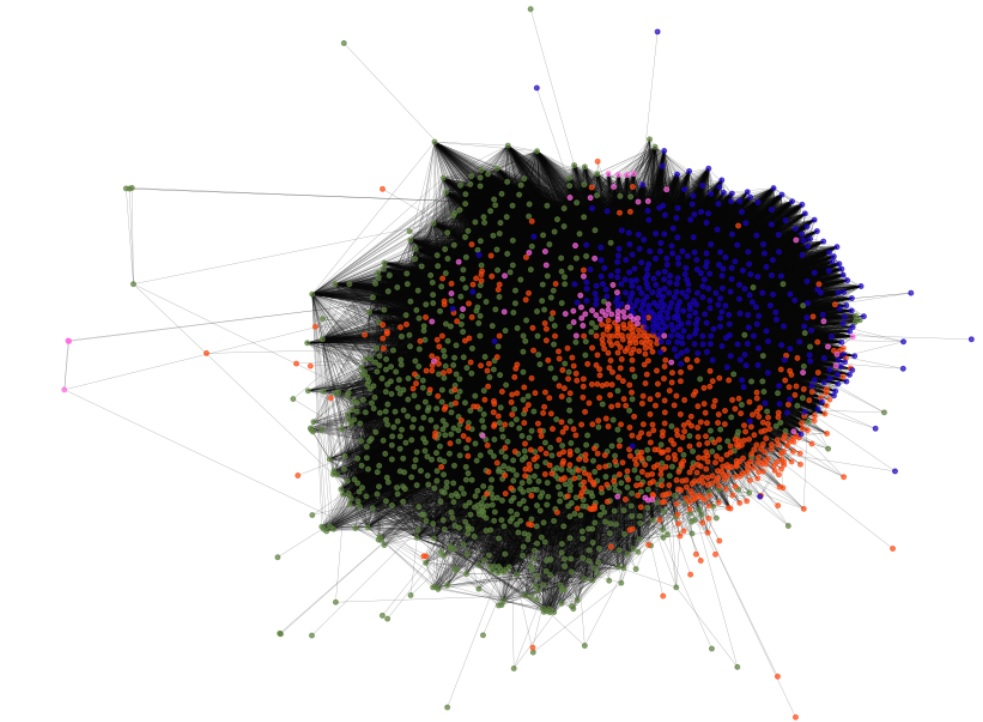

Using python's Louvain community detection algorithm to identifiy communities in a graph, we found that there are `4` communities hidding in our network. While this is a rather dense network, the nodes belong to the same community are closely clustered together. However, it is hard to assess the clear distinction between different communities. In the following section, we will move on to explore more about the common traits and distinct characteristics of each section.
***
## 5. Investigation on Characteristics among Communities 
After obtaining four communities from the previous section, we would like to study further on how the communities are formed and what the distinct characteristics of each community are. We will be focusing on the following criterias for study: **Average ratings**, **Sentimental scores**, **Tags analysis** and **Movie genres**. 

### 5.1 Average Ratings among Communities
In this section we would like to determine if the communities are split by their average ratings. 

After we have identified the corresponding communities that each user belongs to, we calculated the *average rating score* for each user and gathered the proportion which they occupy in their respective community. 

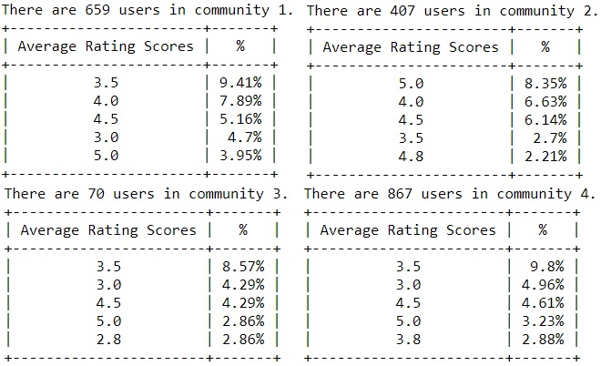

If the communities are splited by average rating, then majority of the users in each community should have the corresponding average rating. However, looking at the top 5 rating groups of each community, they are less than 10% of their respective population. Hence, we would like to conclude that the communities are not split by the average ratings given by users.

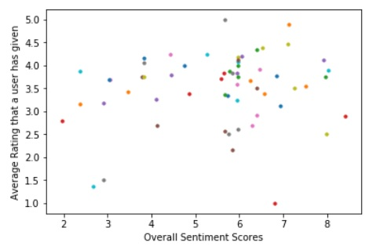

The above is the scatter plot of Average Rating VS Sentiment Score given by each user. We do not observe any obvious pattern in the plot, which suggests that there is no direct correlation between the average rating and sentiment score. Therefore, sentiment scores given by users could be another possible factor which the community formation is basd on. In the next section, we will determine if this hypothesis is true.

### 5.2 Sentiment Scores among Communities
#### 5.2.1 Distribution of Overall Sentiment Scores
<figure>
  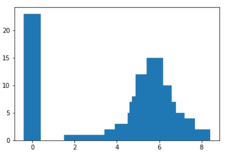
  <figcaption text-align="center">Sentiment distribution (with score 0)</figcaption>
</figure>
<br/>
<figure>
  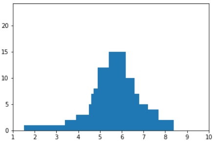
  <figcaption text-align="center">Sentiment distribution (without score 0)</figcaption>
</figure>

Words with sentiment score of 0 are usually neutral or not included in the happiness index table. While we study the distribution of overall sentiment scores given by all users, we discard those of 0 sentiment score and find that the rest of the scores actually follow a normal distribution, with mean of 6, which is slightly positive. 

#### 5.2.2 Sentiment Scores for each Communities
<figure>
  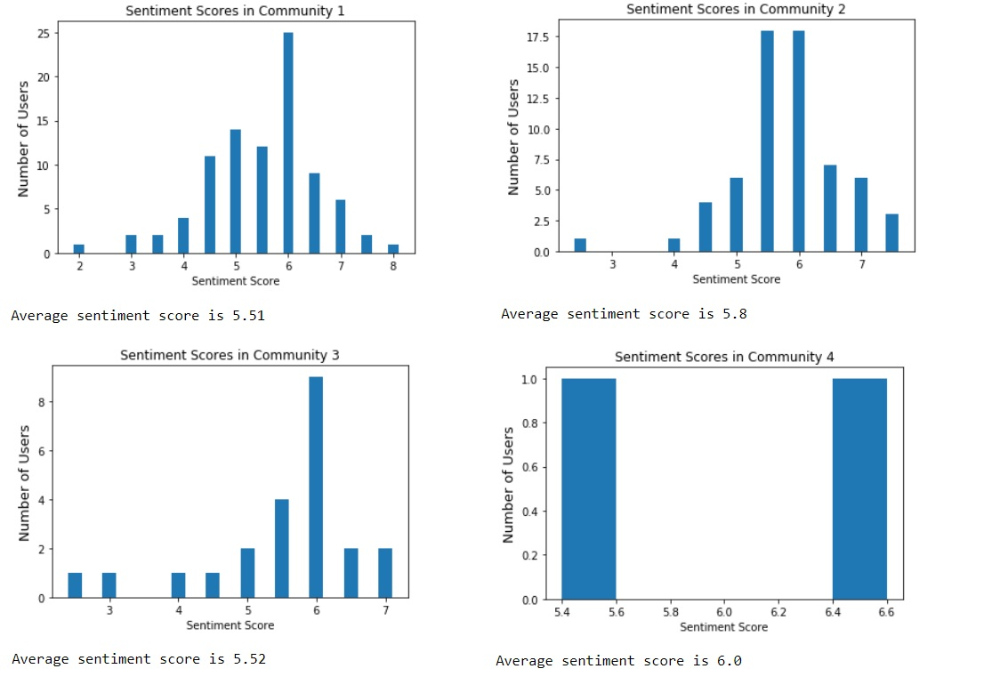
  <figcaption text-align="center">Sentiment scores for each community</figcaption>
</figure>

The sentiment score distributions and the average sentiment scores appear to be similar for first three community groups. Community 4 could be considered as an outlier as there are only 70 users included and 2 users with non-zero sentiment scores. Thus, we would like conclude that the communities is not split based on sentiment scores.

### 5.3 Text Analysis
#### 5.3.1 Top Tags
*       **Top 1 frequently used tags by all users** <br/>
Through our research, we found that the most frequently used tag by all users is `Comedy`. 

*       **Top 30 frequently used tags by all users**
1.      comedy
2.      atmospheric
3.      dark
4.      horror
5.      based
6.      scifi
7.      ending
8.      story
9.      twist
10.     bad
11.     plot
12.     visually
13.     romance
14.     book
15.     action
16.     space
17.     great
18.     film
19.     war
20.     nudity
21.     appealing
22.     predictable
23.     true
24.     acting
25.     drama
26.     dystopia
27.     friendship
28.     thriller
29.     funny
30.     humor

By examining the most frequent used tags, we see that users usually give tags which are genres or themes of the movies they watch, and these tags tend to be neutral. Thus, we can infer that the tags given by users are closely associated with the movies they have watched. This suggests the community may be defined by different genres of movies the user watch. In the following parts, we will study the behaviour of users in selecting movie genres in various communities.

#### 5.3.2 WordCloud for each Community 
Looking at the top 10 most important tags ranked based on TF-IDF, the score obtained are rather small. Thus, we need to transform the TF-IDF score when feeding to the word cloud generation. This is done by times the original TF-IDF score with a factor of 1000. The rationale of choosing 1000 is due the max TF-IDF being 0.00903 (3 significant figures) and after the product we will obain 9.03 which will roughly allow us to transform the scale to 1-10. Furthermore, the fact that the top 10 TF-IDF scores being small suggests, these tags are probably seen in other communities as well. It suggests there are common traints among the 4 communities identified. 

*       **Community 1**
<figure>
  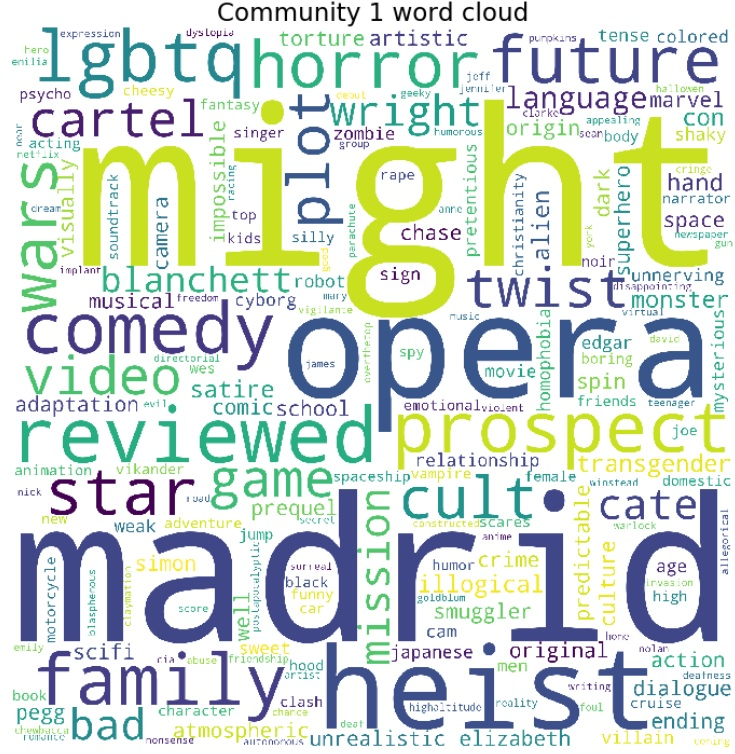
  <figcaption text-align="center">Word cloud of Community 1's tags</figcaption>
</figure>
Words such as might, opera, heist and madrid defines community one as they are much bigger in size and can be easily notced in the word cloud. We also see words such as comedy, horror, family that describes genres of movies. This suggest that majority of community one users tend to watch such genres.

*       **Community 2**
<figure>
  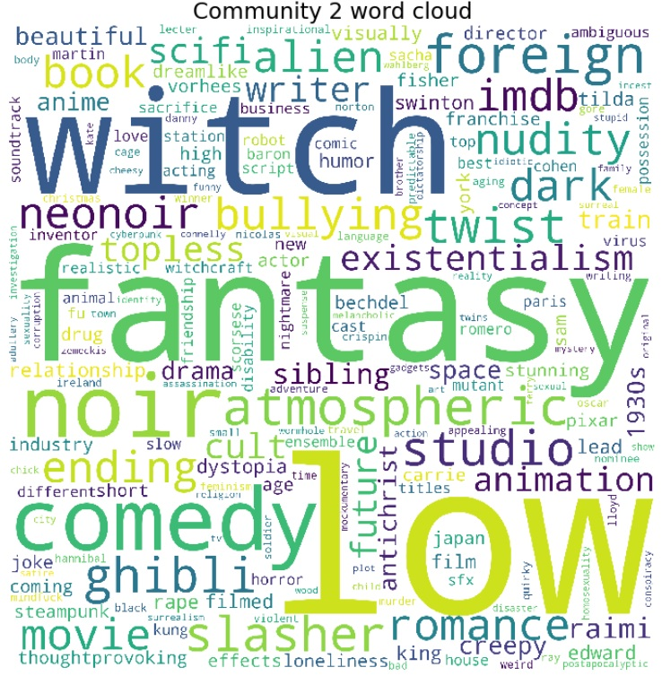
  <figcaption text-align="center">Word cloud of Community 2's tags</figcaption>
</figure>
Words such as witch, fantasy, comedy defines community two. These words suggest that community two users tend to watch fairy tale, cartoonic genres of movies or movies that contain more imaginery elements. Furthermore, we also see words such as ghibli, animation and foreign which may also suggest they watch movies that are made in other countries such as Japan.

*       **Community 3**
<figure>
  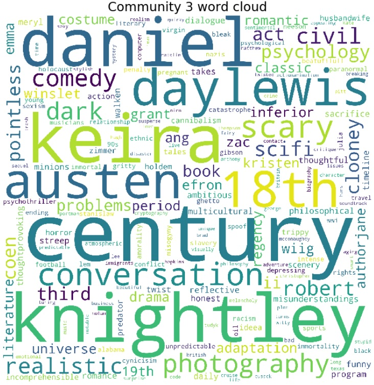
  <figcaption text-align="center">Word cloud of Community 3's tags</figcaption>
</figure>
Words such as century, 18th and conversation defines community three. We also see words such as lewis, austen which are possibly the people related to the movie. For example, austen may refer to Jane Austen and the books that are written by her. Her stories are mostly based on the lives in 18th. This corresponds to the highlighted 18th in the word cloud. Time in the movie production seems to be an important characteristic for this community. The users in this community are likely to have a preference for movies that features the stories during 18th and 19th centuries. They might be in favour of the production by particular writer or actor.

*       **Community 4**
<figure>
  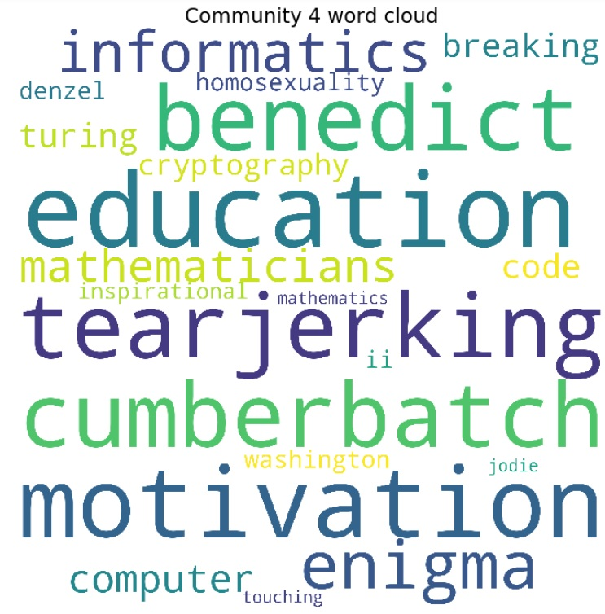
  <h6 position="center">Word cloud of Community 4's tags</h6>
</figure>
As we understand previously, community four is much smaller by size compared to other communities. Thus, the tags featured in the word cloud will also be less. It is interesting to note that the top 10 important tags shares the same score. This means that each of these tags hold equal importance in defining community four. Words such as informatics, education, tearjerking, inspirational seems to suggest that community four users tend to movies that are more informative and have educational values. In particular, there are quite a number of words that are related to a specifc academic topic such as informatics, crptography and code.

> Based on the word clouds generated for each community, the distinct characteristics for each community are highly related to movie genres. While each community has its own distinct characteristics, we realise there are some common traints among the communities. For example, comedy is seen in both community 1 and 2. Thus we are interested to further find the common traits among the communities and the non-common ones.

#### 5.3.3 Common Tags among Communities
1.      comedy
2.      horror
3.      action
4.      story
5.      ending

The top 5 tags are as shown above. It suggests that movie genres including `comedy`, `horror`, `action` and `story` are popular for all communities. 

#### 5.3.4 Non-Common Tags for each Communities 
*       **Top 5 non-common tags given by Community 1 users**
1.      bad
2.      boring
3.      dark
4.      adventure
5.      twist

The top 5 tags for community 1 are very much related to the *excitement* of the plot. Users in this community seems to be more interested in movie that have twisted plots with *dramatic storylines* such as adventure type of movies.

*       **Top 5 non-common tags given by Community 2 users**
1.      oscar
2.      love
3.      female
4.      inspirational
5.      friendship

The tags highlighted in community 2 are more related to *emotional feelings* and *relationship*. They put the emphasis on the emotional touch created by the movie. This group of users probably favours more for movies that are emotional themes. 

*       **Top 5 non-common tags given by Community 3 users**
1.      alan
2.      scifi
3.      dark
4.      period
5.      austen

This group of users seems to have a mixed taste. Both `scifi` and `period` are highlighted in the top 5 tags. While scifi indicates they have a favour towards science fiction which are things that are more modern, period and `austen` indicate they do have a favour towards movies that are developed from well-known literatures as well. 

*       **Top 5 non-common tags given by Community 4 users**
1.      motivation
2.      foster
3.      inspirational
4.      true
5.      bittersweet

For the last community, the words are all pretty positive. This group of users seem to prefer the movies that pass a positive information by inferring from text including `motivation` and `inspirational`. They are looking for the element of growth in the movies they would like to watch. 

> By looking at the tags, we find out the tags for each community are very much linked to different movie genres. Thus, we would like further find out the movie genres that are related to each communities and explore the common and distinct movie genres favoured by different communities.

### 5.4 Movie Genres among Communities 
#### 5.4.1 Top Movie Genres for each Community
*       **Community 1**
<figure>
  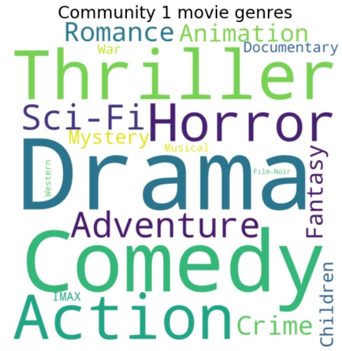
  <h6 position="center">Word cloud of Community 1's movie genres</h6>
</figure>
Community 1 users likes to watch `Drama`, `Action`, `Comedy`, `Thriller` movies genres. These genres of movies often contain the dramatic plots.

*       **Community 2**
<figure>
  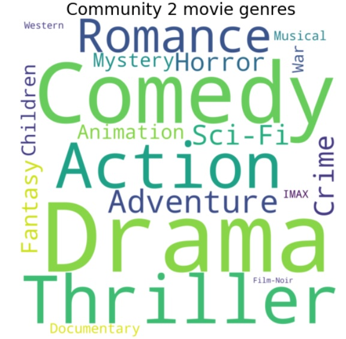
  <h6 position="center">Word cloud of Community 2's movie genres</h6>
</figure>
We see that users from Community 2 likes to watch `Drama`, `Comedy`, `Thriller` and `Action` movies. `Romance` and `Adventure` seems to stand out next which suggest this genre could be distinctive to this community.

*       **Community 3**
<figure>
  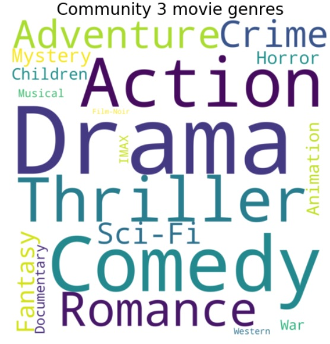
  <h6 position="center">Word cloud of Community 3's movie genres</h6>
</figure>
Like the previous two communities, users from Community 3 likes to watch `Action`, `Comedy`, `Thriller` and `Drama` movies. The distinct genres here could be `Romance` and `Sci-Fi`.

*       **Community 3**
<figure>
  
  <h6 style=test-align:"center";>Word cloud of Community 3's movie genres</h6>
</figure>
Like the previous two communities, users from Community 3 likes to watch `Action`, `Comedy`, `Thriller` and `Drama` movies. The distinct genres here could be `Romance` and `Sci-Fi`.

*       **Community 4**
<figure>
  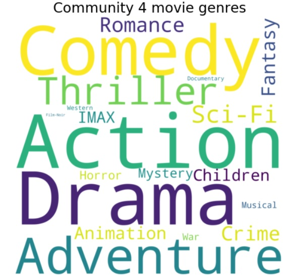
  <h6 style=test-align:"center";>Word cloud of Community 4's movie genres</h6>
</figure>
Like the previous three communities, users from Community 3 likes to watch `Action`, `Drama` and `Comedy` movies. Surprisingly, `Thriller` is not the top in the list of most watched genres. We also observed that users from Community 4 have a tendency to watch `Adventure` genre as well. 

> As we observed, Action, Comedy and Drama are the most common movie genres among users from all four communities we have. Tags which are likely to be associated with Action movies such as "predictable", "dark" and "twist" are thus the top common tags for all communities. 

On the other hand, we also notices the difference in the communities. 

Other than Action movies, Community 1 users tend to watch Horror movies which explains its unique tags such as "atmospheric". Users in Community 2 tend to watch Romance and Adventure movies, thus the top unique tags for them are words like "love", "romance" and "inspirational". Community 3 users prefer movies of Sci-Fi and Romance. This leads to tags such as "romantic" and "scifi". While users from Community 4 are more interested in Adventure and Thriller movies. This aligns with its top tags of "survival" and "foster" (foster relationships during an adventure). 

Besides looking at the general picture for each community, we would like to further explore the distinctive characteristics for each community.

#### 5.4.2 Distinct Movie Genres for each Community
*       **Community 1**


***
## 6. Conclusion 
